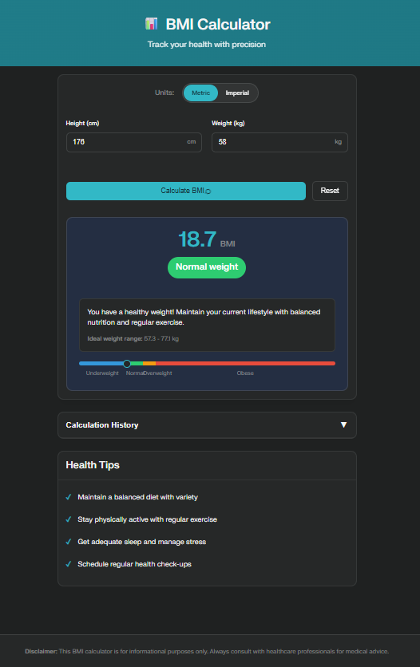

```markdown
# 📊 BMI Calculator App

[](https://github.com/yourusername/bmi-calculator/stargazers)
[](https://github.com/yourusername/bmi-calculator/network/members)
[](LICENSE)
[](https://app.netlify.com/sites/YOUR_SITE_NAME/deploys)

A modern, responsive, and feature-rich **Body Mass Index (BMI) Calculator** built with **HTML, CSS, and JavaScript**.  
It instantly calculates BMI, supports **metric and imperial** units, keeps a calculation history, and gives **health recommendations** — all with a **clean, mobile-friendly UI**.

---

## 🌐 Live Demo
🚀 **Live App:** [View BMI Calculator](https://jatingoyal14.github.io/BMI-Calculator/)  
 
---

## 🚀 Features

- 📏 **Real-time BMI calculation**
- 🔄 **Metric & Imperial unit support**
- 🎨 **Color-coded results** following WHO classification
- 📜 **History of last 5 calculations**
- 🏹 **Ideal weight range suggestions**
- 📱 **Responsive mobile-first design**
- ♿ **Accessibility friendly** with ARIA labels
- ✅ **Form validation & error handling**

---

## 📸 Screenshot

  
---

## 🧮 BMI Formula

**Metric:**
```
BMI = weight(kg) / (height(m)²)
```

**Imperial:**
```
BMI = (703 × weight(lbs)) / (height(in)²)
```

---

## 🛠️ Tech Stack

- **HTML5** – Semantic & accessible markup  
- **CSS3** – Grid, Flexbox, variables, responsive design  
- **JavaScript (ES6+)** – Modular & clean code  
- **No frameworks** – Runs entirely in browser

---

## 📂 Project Structure

```
BMI-Calculator/
│── index.html          # Main HTML file
│── style.css           # Styles
│── app.js              # App logic
│── assets/             # Images, icons, demo GIFs
│── README.md           # Documentation

```

---

## ▶️ Getting Started

### 1️⃣ Clone the Repository
```
git clone https://github.com/yourusername/bmi-calculator.git
cd bmi-calculator
```

### 2️⃣ Open in Browser
Just open `index.html` in your favorite browser.  
*(No server setup required)*
---

## 📊 WHO BMI Categories

| Category      | BMI Range  | Color |
|---------------|------------|-------|
| Underweight   | < 18.5     | 🔵 Light Blue |
| Normal        | 18.5–24.9  | 🟢 Green |
| Overweight    | 25–29.9    | 🟠 Orange |
| Obese         | ≥ 30       | 🔴 Red |

---

## ⚠️ Disclaimer
This is **not** a medical diagnostic tool. For health concerns, please consult a medical professional.

---

## 📌 Roadmap / Future Features
- 💾 Persistent history using local storage
- 📊 BMR & Body Fat % calculators
- 🌍 Multi-language support
- 📄 Export results as PDF

---

## 🤝 Contributing
1. Fork the repo  
2. Create a branch: `feature/your-feature`  
3. Commit & push your changes  
4. Submit a pull request  

---

## 📄 License
Licensed under the **MIT License** – use, modify, and share freely.

---

### 👨‍💻 Author
**Jatin Goyal** 
🔗 [Portfolio](https://yourwebsite.com) • 📧 jatingoyal01407@gmail.com
```

